<div align="center">

<!-- ═══════════════════════════════════════════════════════ -->
<!--              CYBERPUNK BOOT SEQUENCE                   -->
<!-- ═══════════════════════════════════════════════════════ -->

[](https://git.io/typing-svg)

<!-- ═══════════════════════════════════════════════════════ -->
<!--              ANIMATED CYBERPUNK HEADER SVG             -->
<!-- ═══════════════════════════════════════════════════════ -->



<!-- ═══════════════════════════════════════════════════════ -->
<!--                   TYPING ANIMATION                     -->
<!-- ═══════════════════════════════════════════════════════ -->

<br/>

[](https://git.io/typing-svg)

<br/>

<!-- ═══════════════════════════════════════════════════════ -->
<!--                   PROFILE BADGES                       -->
<!-- ═══════════════════════════════════════════════════════ -->

[](https://github.com/abdullahabid04)
[](https://github.com/abdullahabid04?tab=followers)
[](https://github.com/abdullahabid04)

</div>

<!-- ═══════════════════════════════════════════════════════ -->
<!--                  ANIMATED DIVIDER                      -->
<!-- ═══════════════════════════════════════════════════════ -->


<!-- ═══════════════════════════════════════════════════════ -->
<!--                    ABOUT ME                            -->
<!-- ═══════════════════════════════════════════════════════ -->

<div align="center">

## ⚡ // SYS.IDENTITY

[](https://git.io/typing-svg)

</div>

```typescript
const abdullahAbid = {
  role        : "Software Engineer  →  Backend · IoT · SaaS",
  company     : "Cosmos Algos  [ Founder & CEO ]",
  lab         : "CARE Lab  [ Software Developer ]",
  education   : "BSc Artificial Intelligence  @  IUB  (2023–2027)",
  location    : "Bahawalpur, Punjab, Pakistan  🇵🇰",
  remote      : true,
  experience  : "5 years  (2020 → Present)",

  journey: [
    "2020  →  C++ console programs from a challenge my father gave me",
    "2021  →  Python · Flutter · first real client projects",
    "2022  →  Industrial automation · Raspberry Pi · hardware integration",
    "2023  →  IoT SaaS platforms · Laravel · team engineering",
    "2024  →  Computer vision · AI pipelines · firmware systems",
    "2025  →  Scaling products · DeepEmbed contract · still building"
  ],

  currentlyBuilding : ["FlockSense IoT SaaS", "FluxSense AI Pipeline", "primera (C#)"],
  lookingFor        : "Remote backend / full-stack roles",

  philosophy: "Build it. Ship it. Improve it. Repeat."
};
```


<!-- ═══════════════════════════════════════════════════════ -->
<!--                   TECH STACK                           -->
<!-- ═══════════════════════════════════════════════════════ -->

<div align="center">

## 🛠 // TECH.ARSENAL

[](https://git.io/typing-svg)

</div>

<div align="center">

### Core Languages

[](https://php.net)
[](https://python.org)
[](https://dart.dev)
[](https://isocpp.org)
[](https://en.wikipedia.org/wiki/C_(programming_language))
[](https://developer.mozilla.org/en-US/docs/Web/JavaScript)
[](https://learn.microsoft.com/en-us/dotnet/csharp/)

### Frameworks & Platforms

[](https://laravel.com)
[](https://flutter.dev)
[](https://fastapi.tiangolo.com)
[](https://vuejs.org)
[](https://riverbankcomputing.com/software/pyqt/)
[](https://dotnet.microsoft.com)

### Databases

[](https://mysql.com)
[](https://aws.amazon.com/dynamodb/)
[](https://mongodb.com)

### Cloud & DevOps

[](https://aws.amazon.com)
[](https://docker.com)
[](https://linux.org)
[](https://raspberrypi.com)
[](https://git-scm.com)

### AI & Vision

[](https://opencv.org)
[](http://www.open3d.org)
[](https://www.intelrealsense.com)

### IoT & Embedded

[](https://espressif.com)
[](https://modbus.org)
[](https://github.com/abdullahabid04)

### Tools

[](https://postman.com)
[](https://swagger.io)

</div>

<br/>

<!-- SKILLS ICONS GRID -->
<div align="center">

</div>


<!-- ═══════════════════════════════════════════════════════ -->
<!--                  GITHUB STATS                          -->
<!-- ═══════════════════════════════════════════════════════ -->

<div align="center">

## 📊 // SYS.METRICS

[](https://git.io/typing-svg)

<br/>


&nbsp;&nbsp;


<br/><br/>


</div>


<!-- ═══════════════════════════════════════════════════════ -->
<!--               PROJECTS                                 -->
<!-- ═══════════════════════════════════════════════════════ -->

<div align="center">

## 🚀 // PROJECT.LOG

</div>

<br/>

<!-- ─────────────────────────────────────────────────────── -->
<div align="center">

### 🏭 Industrial & Desktop Systems

</div>
<!-- ─────────────────────────────────────────────────────── -->

<table width="100%">
<tr>
<td width="50%" valign="top">

### 🧪 Primera — Primer Analyzer System
> Delivered · Industrial Hardware · CARE Lab

A desktop-based industrial testing and analysis system for Primer devices, designed to automate structured test workflows with hardware-integrated execution. The system communicates with devices using a primarily synchronous model, with event-driven handling for specific scenarios, enabling reliable batch processing and real-time decision-making.

**Key Contributions:**
- Designed and developed a hardware-integrated testing system for automated validation of Primer devices
- Implemented hybrid communication architecture — primarily synchronous with event-driven components
- Built batch processing engine for simultaneous testing of 10–15 devices per batch
- Developed structured multi-stage test workflows with controlled sequencing (4 tests per device)
- Engineered automatic result evaluation — classifies devices as Serviceable / Non-Serviceable
- Built dashboards for real-time monitoring, historical analysis, and operational insights
- Added device registration, calibration workflows, and lifecycle management support


</td>
<td width="50%" valign="top">

### 🔋 Battery Charger Health & Charging Management System
> Delivered · Industrial · CARE Lab

A desktop-based industrial application designed to monitor and control battery charging systems through direct hardware integration. The system communicates with charging units using defined device communication protocols, enabling continuous real-time data acquisition for battery health, charging cycles, and operational states. Built for industrial environments, emphasizing reliability, long-running stability, and consistent performance under continuous load.

**Key Contributions:**
- Developed real-time monitoring system for battery health metrics and charging cycle analysis
- Implemented hardware communication layer using structured protocols for continuous device interaction
- Designed control logic to manage and optimize charging behavior based on live system conditions
- Built desktop interface for real-time visualization of operational and diagnostic data
- Engineered for high reliability and uninterrupted execution in industrial environments


</td>
</tr>

<tr>
<td width="50%" valign="top">

### 〰️ Oscilloscope Signal Analysis Tool
> Delivered · Desktop · CARE Lab

A desktop-based signal processing application developed to enhance and automate waveform analysis workflows traditionally performed using hardware oscilloscopes. The tool enables interactive visualization of signal data with advanced inspection capabilities, incorporating automated computation of key signal characteristics to significantly reduce manual effort and improve accuracy.

**Key Contributions:**
- Developed interactive waveform visualization system for detailed signal inspection
- Implemented zooming and panning for high-resolution signal exploration
- Built automated algorithms to extract pulse width, pulse count, and signal metrics
- Reduced dependency on manual oscilloscope-based measurements
- Enabled handling of large signal datasets beyond hardware screen constraints


</td>
<td width="50%" valign="top">

### ⚡ VFD Remote Control System
> Prototype · Full-Stack IoT · Cosmos Algos

A full-stack remote monitoring and control system for industrial Variable Frequency Drives, spanning firmware to cloud backend to mobile — built end-to-end as a complete hardware-software integration.

**Key Contributions:**
- Programmed ESP32 firmware with MODBUS RTU/TCP communication to VFD hardware
- Real-time read of RPM, voltage, and operational state from hardware
- Built touchscreen GUI on ESP32 device side
- Developed Laravel backend for telemetry ingestion and cloud→device command routing
- Built Flutter mobile app for remote start/stop, speed adjustment, and live health dashboard


</td>
</tr>
</table>

<br/>

<!-- ─────────────────────────────────────────────────────── -->
<div align="center">

### 🌐 IoT & SaaS Platforms

</div>
<!-- ─────────────────────────────────────────────────────── -->

<table width="100%">
<tr>
<td width="50%" valign="top">

### 📳 VibCare — Industrial Vibration Monitoring Platform
> Production · Backend Contribution · Cosmos Algos

A SaaS-based industrial IoT platform focused on vibration monitoring of machinery. Collects and processes vibration sensor data to analyze machine behavior and identify irregular patterns over time. Contribution was at the backend and system level, working on data ingestion, processing workflows, and ensuring reliable handling of real-world sensor data within the platform.

**Key Contributions:**
- Contributed to backend systems for vibration data ingestion and processing
- Supported development of workflows for analyzing machine behavior patterns
- Worked on handling real-world sensor data in industrial environments
- Ensured reliable data flow between devices and cloud systems
- Assisted in building scalable platform-level data processing components


</td>
<td width="50%" valign="top">

### ⚡ PowerEye — Energy & Power Analytics Platform
> Production · Backend Contribution · Cosmos Algos

A SaaS-based IoT platform designed to monitor and analyze energy consumption patterns. Processes real-time power usage data and provides insights along with basic predictive analytics for better understanding of energy utilization. Role focused on backend development and system-level contributions, particularly in data processing workflows and platform functionality.

**Key Contributions:**
- Contributed to backend systems for energy data ingestion and processing
- Supported analytics workflows for understanding power usage patterns
- Worked on structuring and handling real-time sensor data
- Assisted in enabling system-level analytics and data-driven insights
- Contributed to scalable backend components for data processing


</td>
</tr>

<tr>
<td width="50%" valign="top">

### 🌡️ Sentron — Multi-Sensor IoT Monitoring Platform
> Production · Backend Contribution · Cosmos Algos

A general-purpose IoT SaaS platform designed to support multiple sensor types — including temperature and humidity — with capabilities for both monitoring and control of connected devices. Contribution focused on backend and system-level development, working on data handling, processing workflows, and enabling flexible support for diverse sensor integrations.

**Key Contributions:**
- Contributed to backend systems for handling multi-sensor data streams
- Supported development of monitoring and control workflows
- Worked on processing and managing diverse sensor data types
- Enabled flexible integration of different IoT devices and sensor types
- Assisted in building scalable platform-level backend components


</td>
<td width="50%" valign="top">

### 🐔 Poultry Farm Management IoT Platform
> Production · Backend Contribution · Cosmos Algos

Contributed to the backend development of an IoT-based poultry farm management platform, focusing on building APIs for real-time sensor data ingestion and system communication. The work involved handling continuous data streams from connected devices, designing efficient data flow mechanisms, and supporting scalable backend infrastructure for monitoring farm conditions.

**Key Contributions:**
- Developed RESTful APIs for ingesting real-time sensor data from IoT devices
- Implemented backend logic for handling continuous device communication and data flow
- Designed efficient data processing mechanisms for high-frequency monitoring scenarios
- Contributed to scalable backend architecture supporting multiple devices and data streams
- Ensured reliable data handling for integration with monitoring and control systems


</td>
</tr>

<tr>
<td width="50%" valign="top">

### 🔄 IoT Data Processing & Visualization System
> Production · Backend · Cosmos Algos

A high-performance backend system developed to handle real-time ingestion, processing, and visualization of IoT sensor data. Designed to efficiently process high-frequency data streams through structured pipelines with a key focus on optimizing database queries to significantly improve dashboard responsiveness and reduce latency.

**Key Contributions:**
- Developed APIs for ingesting real-time, high-frequency IoT sensor data
- Designed and implemented time-series data processing and aggregation pipelines
- Optimized database queries and indexing strategies for efficient data retrieval
- Reduced visualization latency — enabled near real-time dashboard performance
- Built scalable data handling mechanisms for continuous sensor streams
- Improved overall system performance through backend optimization techniques


</td>
<td width="50%" valign="top">

### ☁️ AWS-Based IoT Cloud APIs
> Production · Serverless · Cosmos Algos

A cloud-native backend system developed using AWS serverless services to support IoT device communication and real-time data processing. Leverages AWS IoT Core for device connectivity and integrates Lambda-based APIs to handle incoming data. Designed for scalability, security, and efficient data handling across IoT monitoring systems.

**Key Contributions:**
- Developed serverless APIs using AWS Lambda and API Gateway for handling IoT data
- Integrated AWS IoT Core for secure and reliable device communication
- Designed scalable data storage using DynamoDB
- Implemented authentication and authorization using IAM roles and Cognito
- Enabled real-time data exchange between IoT devices and backend services
- Built scalable and maintainable cloud architecture using managed AWS services


</td>
</tr>

<tr>
<td width="50%" valign="top">

### 📲 OTA Firmware Update Management System
> 🚧 In Development · IoT · Cosmos Algos

An IoT-based system under active development aimed at enabling secure and scalable over-the-air firmware updates for distributed devices. Being designed to manage firmware versioning, device grouping, and controlled deployment strategies to ensure reliable updates across large device fleets.

**Key Contributions:**
- Designed system architecture for OTA firmware update workflows in distributed IoT environments
- Implemented initial firmware versioning and release management logic
- Developed device grouping mechanisms for targeted and staged update deployments
- Planned secure rollout strategies to minimize risk during firmware updates
- Currently building components for update execution, monitoring, and status tracking


</td>
<td width="50%" valign="top">

### 🤖 FluxSense — AI Data & Prediction Pipeline
> Production · Cosmos Algos

An end-to-end data pipeline system that collects structured farm sensor data, preprocesses it, and feeds it into an AI inference system for farm performance prediction. Focused on practical AI deployment rather than research — running inference inside a production-style backend.

**Key Contributions:**
- Designed data ingestion pipeline for AI training and prediction workflows
- Built APIs for structured collection of sensor and farm records
- Implemented preprocessing: noise filtering · temporal alignment · feature extraction
- Integrated AI inference layer for rate prediction and farm performance analysis
- Ensured reliable data flow from raw sensor input to model output


</td>
</tr>
</table>

<br/>

<!-- ─────────────────────────────────────────────────────── -->
<div align="center">

### 📱 Mobile Applications

</div>
<!-- ─────────────────────────────────────────────────────── -->

<table width="100%">
<tr>
<td width="33%" valign="top">

### 🚲 Electric Bike Monitoring & Control App
> Delivered · Flutter · IoT Integration

A mobile application developed to monitor and interact with an electric bike through IoT integration. Provides real-time insights into key operational metrics and incorporates safety features to enhance usability and security.

**Key Contributions:**
- Developed real-time monitoring for battery usage, charging cycles, and distance
- Implemented location tracking and ride history visualization
- Integrated safety alerts for unauthorized activity detection
- Connected app with backend APIs for real-time data sync


</td>
<td width="33%" valign="top">

### 💧 Smart Water Dispenser App
> Delivered · Flutter · IoT Systems

A mobile application designed to interact with an IoT-enabled water dispenser, providing real-time monitoring and control capabilities. Tracks usage patterns, operational states, and power consumption with continuous backend synchronization.

**Key Contributions:**
- Developed real-time monitoring and control for water dispenser systems
- Tracked water usage, system activity, and operational status
- Displayed hot/cold water distribution data
- Monitored power consumption and device performance metrics


</td>
<td width="33%" valign="top">

### 🏠 Home Automation Mobile App
> Delivered · Flutter · Smart Systems

A mobile application providing centralized control and monitoring of smart home devices including bulbs and fans. Enables remote device management with insights into usage patterns and electricity consumption.

**Key Contributions:**
- Built centralized control for multiple smart home IoT devices
- Enabled remote operation of bulbs, fans, and connected devices
- Implemented real-time device status monitoring
- Provided electricity consumption and usage pattern insights


</td>
</tr>
</table>

<br/>

<!-- ─────────────────────────────────────────────────────── -->
<div align="center">

### 🎥 Computer Vision & Research

</div>
<!-- ─────────────────────────────────────────────────────── -->

<table width="100%">
<tr>
<td width="50%" valign="top">

### 📷 RealSense RGB-D Data Acquisition System
> Delivered · DeepEmbed Lab · Jul–Aug 2025

A Python system for capturing, processing, and organizing structured RGB-D datasets using Intel RealSense D435i. Built for computer vision research with a complete pipeline from raw capture to structured ML-ready datasets.

**Key Contributions:**
- Built synchronized RGB + depth frame capture with keyboard-triggered session management
- Implemented depth-to-RGB alignment and RGB-D frame generation
- Developed point-cloud generation, surface reconstruction, and 3D clustering with Open3D
- Built automated dataset organization pipeline for ML training workflows
- Supported broiler weight estimation research dataset generation


</td>
<td width="50%" valign="top">

### 🎬 Automatic Subtitle Generation System
> Experimental · Python · Multimedia Processing

A multimedia processing pipeline designed to automatically generate subtitles from audio and synchronize them with video content. Processes audio streams, converts them into text, and overlays subtitles onto videos for automated content enhancement.

**Key Contributions:**
- Developed audio-to-text conversion pipeline for subtitle generation
- Implemented subtitle synchronization with video timelines
- Built video frame processing using OpenCV
- Automated subtitle overlay generation for video content
- Identified and worked through real-time latency challenges


</td>
</tr>
</table>

<br/>

<!-- ─────────────────────────────────────────────────────── -->
<div align="center">

### 🧩 Supporting Engineering Tools, Data Systems & Core Foundations

</div>
<!-- ─────────────────────────────────────────────────────── -->

<table width="100%">
<tr>
<td width="50%" valign="top">

### 🤖 LLM-Based API Documentation Generator
An intelligent documentation generation system that uses LLMs to automatically create structured API documentation from source code, database schemas, and system definitions. Significantly reduces manual documentation effort across projects.

- Designed extraction of API metadata from codebases and schemas
- Integrated LLMs for generating structured, context-aware documentation
- Automated end-to-end documentation workflow
- Experimented with local LLaMA deployment for offline generation


</td>
<td width="50%" valign="top">

### ⚙️ API Testing & Automation Framework
A backend testing framework designed to automate API validation, performance testing, and bulk request simulation. Enables developers to test backend reliability under different load conditions while validating response accuracy and system stability.

- Designed automated API testing workflows for backend systems
- Implemented bulk request simulation for load and stress testing
- Built validation layers for API responses and error detection
- Enabled scalable testing across multiple backend services


</td>
</tr>

<tr>
<td width="50%" valign="top">

### 📡 IoT Data Simulation Tools
A simulation toolset for generating synthetic IoT sensor data for testing backend systems, pipelines, and scalability limits. Mimics real-world device behavior to support development, debugging, and performance benchmarking of IoT platforms.

- Built system for generating realistic synthetic IoT sensor data
- Simulated device behavior under different operational conditions
- Supported scalability and stress testing of backend systems
- Assisted in debugging and validating data pipelines


</td>
<td width="50%" valign="top">

### 🏗️ Project & Code Structure Automation Tools
A developer productivity tool designed to automate project scaffolding and boilerplate generation. Standardizes project structures and reduces manual setup time, enabling quick initialization of consistent backend architectures.

- Automated generation of standardized project structures
- Created reusable boilerplate templates for backend systems
- Reduced manual setup time for new software projects
- Supported multiple project architecture patterns


</td>
</tr>

<tr>
<td width="50%" valign="top">

### 🧠 AI Inference & Data Processing Pipelines
A backend pipeline system designed to integrate AI inference into data processing workflows. Handles structured data, enables AI-based decision-making, and integrates model outputs into production-style application backends.

- Designed pipelines for integrating AI inference into backend systems
- Processed structured data efficiently for inference workflows
- Enabled real-time AI-based decision-making in applications
- Supported scalable AI-driven backend architectures


</td>
<td width="50%" valign="top">

### 🗄️ SaaS Data Pipelines & Validation Systems
A backend data pipeline system for SaaS applications focusing on data ingestion, validation, and consistency checks. Ensures reliable data flow across services and improves the integrity of SaaS-based backend workflows.

- Designed data ingestion pipelines for SaaS applications
- Implemented validation mechanisms for incoming data streams
- Ensured data consistency across distributed services
- Supported scalable SaaS data processing architecture


</td>
</tr>

<tr>
<td width="50%" valign="top">

### 🖥️ C++ Console-Based Systems & Problem Solvers
A collection of early-stage C++ projects focused on algorithmic problem solving and foundational programming concepts. These projects include console-based system simulations and logic-building exercises that formed the engineering foundation.

- Developed solutions for algorithmic and logic-based problems
- Built console-based system simulations in C++
- Strengthened understanding of data structures and algorithms
- Focused on foundational software engineering principles


</td>
<td width="50%" valign="top">

&nbsp;

</td>
</tr>
</table>


<!-- ═══════════════════════════════════════════════════════ -->
<!--              5-YEAR JOURNEY TIMELINE                   -->
<!-- ═══════════════════════════════════════════════════════ -->

<div align="center">

## 🗓 // TIMELINE.EXEC

[](https://git.io/typing-svg)

</div>

```
2020  ━━━━━━━━━━━━━━━━━━━━━━━━━━━━━━━━━━━━━━━━━━━━━━━━━━━━━━━━━━━━━━ ⚡ THE SPARK
      │  Father handed me a piece of C++ code. I haven't stopped since.
      │  Built a 1,500-line console math quiz. Wrote physics solvers.
      │  Explored DSA, OOP, algorithms — all self-driven.
      │
2021  ━━━━━━━━━━━━━━━━━━━━━━━━━━━━━━━━━━━━━━━━━━━━━━━━━━━━━━━━━━━━━━ 🔭 EXPLORATION
      │  Python · Android Studio · Flutter
      │  Built a 2D online multiplayer game. First real client projects.
      │  Delivered mobile + backend apps for automation clients.
      │
2022  ━━━━━━━━━━━━━━━━━━━━━━━━━━━━━━━━━━━━━━━━━━━━━━━━━━━━━━━━━━━━━━ 🏭 DEPTH
      │  Joined CARE Lab. Industrial automation. Hardware integration.
      │  Raspberry Pi. PyQt5. Battery systems. Test rigs.
      │  Delivered first production hardware-software system.
      │
2023  ━━━━━━━━━━━━━━━━━━━━━━━━━━━━━━━━━━━━━━━━━━━━━━━━━━━━━━━━━━━━━━ 🚀 TRANSITION
      │  Cosmos Algos. Laravel. IoT SaaS. Team engineering.
      │  Shifted from solo dev → collaborative platform engineer.
      │  5 IoT SaaS platforms. DynamoDB. Multi-tenancy. RBAC.
      │
2024  ━━━━━━━━━━━━━━━━━━━━━━━━━━━━━━━━━━━━━━━━━━━━━━━━━━━━━━━━━━━━━━ 🧠 SYSTEMS
      │  Computer vision. AI data pipelines. Firmware OTA.
      │  VFD control. RealSense RGB-D. Real-time streaming.
      │
2025  ━━━━━━━━━━━━━━━━━━━━━━━━━━━━━━━━━━━━━━━━━━━━━━━━━━━━━━━━━━━━━━ ⚙ ENGINEERING
      │  DeepEmbed contract. Scaling platforms. AI inference integration.
      │  Fewer tutorials. More engineering judgment.
      │
NOW   ●  Still building. Still learning. BSc AI in progress.
```


<!-- ═══════════════════════════════════════════════════════ -->
<!--             ACTIVITY GRAPH                             -->
<!-- ═══════════════════════════════════════════════════════ -->

<div align="center">

## 📈 // NET.ACTIVITY


</div>


<!-- ═══════════════════════════════════════════════════════ -->
<!--             CONTRIBUTION SNAKE                         -->
<!-- ═══════════════════════════════════════════════════════ -->

<div align="center">

## 🐍 // CONTRIB.SNAKE

<picture>
  <source media="(prefers-color-scheme: dark)" srcset="https://raw.githubusercontent.com/abdullahabid04/abdullahabid04/output/github-contribution-grid-snake-dark.svg">
  <source media="(prefers-color-scheme: light)" srcset="https://raw.githubusercontent.com/abdullahabid04/abdullahabid04/output/github-contribution-grid-snake.svg">
  
</picture>

</div>


<!-- ═══════════════════════════════════════════════════════ -->
<!--               ENGINEERING MINDSET                      -->
<!-- ═══════════════════════════════════════════════════════ -->

<div align="center">

## 🧠 // CORE.PRINCIPLES

</div>

<div align="center">

| Principle | Approach |
|-----------|----------|
| 🔨 **How I learn** | Hands-on first. Build before reading. |
| 🧩 **How I solve problems** | Trace the full system — firmware to mobile. |
| 🔁 **How I build** | Ship a working version. Iterate. Improve. |
| 📄 **How I document** | Every API gets a Postman collection + OpenAPI spec. |
| 🤝 **How I collaborate** | Contributor, not over-claimer. Team systems, not solo heroics. |
| ⚖️ **What I value** | Working systems over perfect code. Clarity over cleverness. |

</div>


<!-- ═══════════════════════════════════════════════════════ -->
<!--               CURRENT FOCUS                            -->
<!-- ═══════════════════════════════════════════════════════ -->

<div align="center">

## 🎯 // ACTIVE.PROCESSES

</div>

<div align="center">

```
┌─────────────────────────────────────────────────────────────────┐
│                                                                 │
│   🔭  Building  →  FlockSense · FluxSense · primera (C#)        │
│   📚  Studying  →  BSc AI @ IUB · Advanced IoT architectures    │
│   🌱  Exploring →  AI/ML in SaaS · Scalable cloud infra         │
│   💼  Seeking   →  Remote backend / full-stack engineering role  │
│   🚀  Building  →  Cosmos Algos as a product-led startup         │
│                                                                 │
└─────────────────────────────────────────────────────────────────┘
```

</div>


<!-- ═══════════════════════════════════════════════════════ -->
<!--              LONG-TERM VISION                          -->
<!-- ═══════════════════════════════════════════════════════ -->

<div align="center">

## 🛣 // ROADMAP.FUTURE

</div>

<div align="center">

```
         NOW                  MID-TERM              LONG-TERM
          │                      │                      │
    ┌─────▼──────┐         ┌─────▼──────┐        ┌─────▼──────┐
    │  Engineer  │ ──────► │ Architect  │ ─────► │  Founder   │
    │            │         │            │        │ + Investor  │
    │ Build real │         │ Design how │        │            │
    │  systems   │         │  systems   │        │ Products + │
    │            │         │   work     │        │  Capital   │
    └────────────┘         └────────────┘        └────────────┘
```

- **Software Architecture** — Design systems, not just features
- **SaaS Products** — Cosmos Algos from services → product-led
- **AI Integration** — ML inside real IoT and SaaS systems (not research)
- **Angel Investing** — Early-stage technical founders
- **Personal Brand** — Built on real work, not performance

</div>


<!-- ═══════════════════════════════════════════════════════ -->
<!--               BEYOND CODE                              -->
<!-- ═══════════════════════════════════════════════════════ -->

<div align="center">

## 🌍 // OFF.GRID

</div>

<div align="center">

| ♟️ Chess | 🏓 Table Tennis | ⚙️ Cars & PCs | 🏛 History & Archaeology | 🤖 AI Trends | 🌿 Travel |
|---------|----------------|--------------|--------------------------|-------------|---------|
| Pattern recognition under pressure | Fast decisions, competitive mindset | How systems and components interact | Long-term thinking, cause and effect at scale | Stays current, builds with it | Perspective outside screens |

</div>


<!-- ═══════════════════════════════════════════════════════ -->
<!--                 CONTACT                                -->
<!-- ═══════════════════════════════════════════════════════ -->

<div align="center">

## 📡 // UPLINK.CONNECT

[](https://git.io/typing-svg)

<br/>

[](mailto:abrps2004@gmail.com)
[](https://linkedin.com/in/abdullahabid04)
[](https://github.com/abdullahabid04)

<br/>

> `// Open to remote backend / full-stack engineering opportunities worldwide.`

</div>

<!-- ═══════════════════════════════════════════════════════ -->
<!--                 FOOTER — CYBERPUNK SVG                 -->
<!-- ═══════════════════════════════════════════════════════ -->


